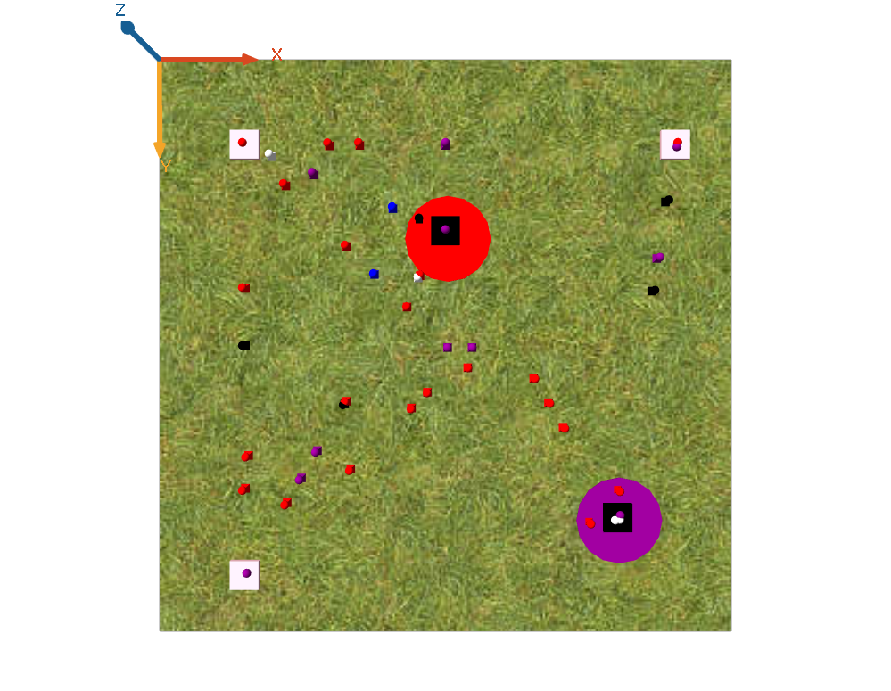
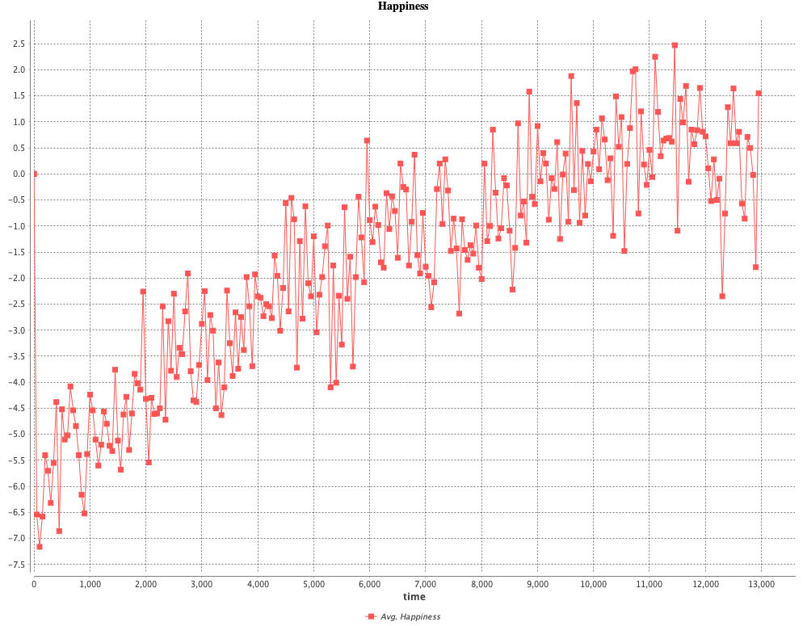
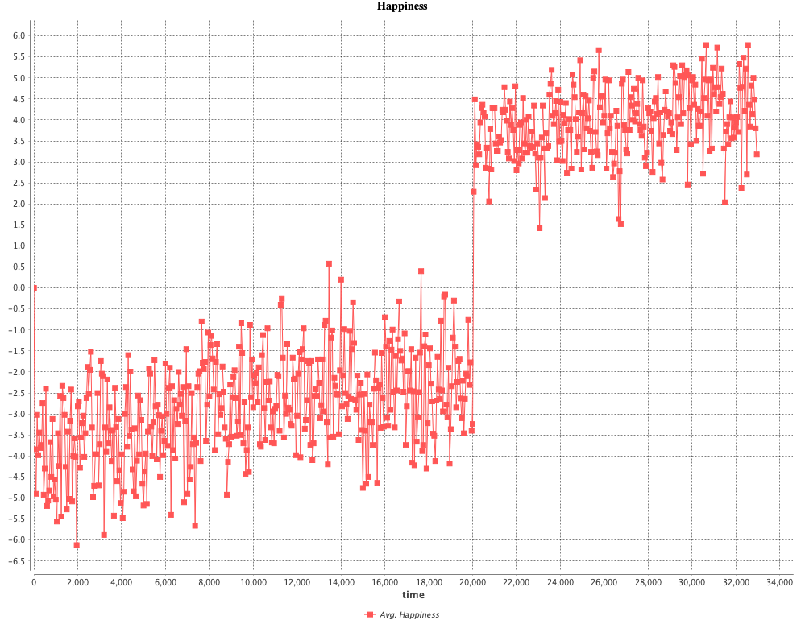
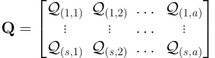
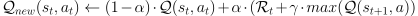

# ID2209 Distributed Artificial Intelligence and Intelligent Agents

All the project work in the course ID2209 Distributed Artificial Intelligence and Intelligent Agents on the Royal Institute of Technology (KTH). Among other things, we did a simulation of festival guests and behaviour with the help of reinforcement learning (Q-learning).

The agents succesfully learned how to create an enjoyable experience. An example is that the agents quickly learned to alternate drinking beer with water as they were more happy if their alcohol level was moderate, instead of agents being wasted. They also learned to congregate in locations that they prefered, where there preferable music genre was being played.

A short report of the project can be found here: [project report](/project-report.pdf)

## Screenshots from simulation

A screenshot of the map when running the simulation

The agents happiness over time. The left chart shows their happiness without a training phase. The right chart shows the agents general happiness when training the agents before the simulation. The happiness without training peaks at about 2.5 units while the happiness with training peaks at over 5.5 units.

	
	

## Q-Learning

The agents had a matrix called Q, that kept track of potential happiness gained from taking particular actions depending on the state of the environment. The rows represent a specific state and the columns represent a specific action.

	

The Q-matrix was updated in every iteration. The new Q-value was calculated from the old one, the current happiness, as well as the potential happiness gained from taking the most prefered action considering the current state of the environment.

	

## License [![MIT license][license-img]][license-url]

> The [`MIT`][license-url] License (MIT)
>
> Copyright (c) 2019 Hannes Rabo
> Copyright (c) 2019 Julius Recep Colliander Celik
>
> Permission is hereby granted, free of charge, to any person obtaining a copy
> of this software and associated documentation files (the "Software"), to deal
> in the Software without restriction, including without limitation the rights
> to use, copy, modify, merge, publish, distribute, sublicense, and/or sell
> copies of the Software, and to permit persons to whom the Software is
> furnished to do so, subject to the following conditions:
>
> The above copyright notice and this permission notice shall be included in all
> copies or substantial portions of the Software.
>
> THE SOFTWARE IS PROVIDED "AS IS", WITHOUT WARRANTY OF ANY KIND, EXPRESS OR
> IMPLIED, INCLUDING BUT NOT LIMITED TO THE WARRANTIES OF MERCHANTABILITY,
> FITNESS FOR A PARTICULAR PURPOSE AND NONINFRINGEMENT. IN NO EVENT SHALL THE
> AUTHORS OR COPYRIGHT HOLDERS BE LIABLE FOR ANY CLAIM, DAMAGES OR OTHER
> LIABILITY, WHETHER IN AN ACTION OF CONTRACT, TORT OR OTHERWISE, ARISING FROM,
> OUT OF OR IN CONNECTION WITH THE SOFTWARE OR THE USE OR OTHER DEALINGS IN THE
> SOFTWARE.
>
> For further details see [LICENSE](LICENSE) file.

[license-img]: https://img.shields.io/badge/license-MIT-blue.svg?style=flat-square
[license-url]: https://github.com/juliuscc/kth-id2209/blob/master/LICENSE
